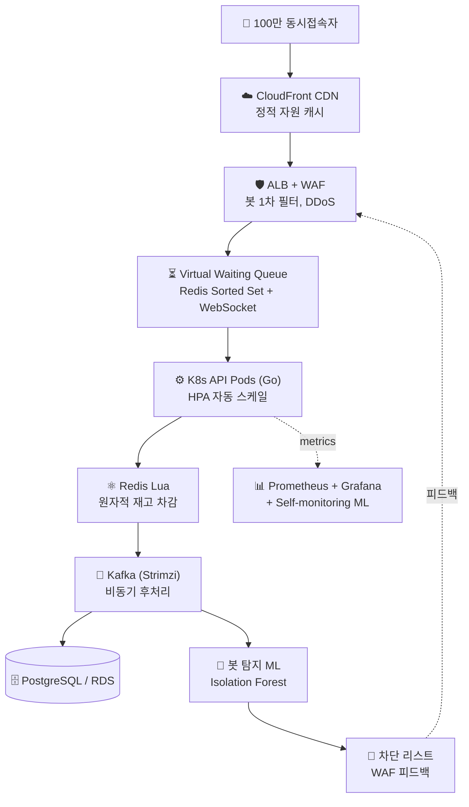

# 🎯 SRE Capstone — 한정판 발급 시스템 (100만 동접)

> 한국 e-commerce·retail의 실제 도전 — **한정 수량 + 트래픽 폭증 + 봇 탐지**를
> 직접 설계·구축하는 사이드 프로젝트 (작업 진행 중)

[]()
[]()
[]()
[]()

---

## 🏗 최종 목표 아키텍처 (Ch 10 캡스톤)



### 핵심 도전
- **동시성·정합성**: oversell 0건 (Redis Lua 원자 연산, Idempotency Key)
- **트래픽 처리**: 평소 100 RPS → 피크 100만 RPS (가상 대기열, Backpressure, HPA)
- **봇 차단**: 매크로/스크립트 자동 탐지 + WAF 실시간 피드백
- **SLO 운영**: p99 지연시간, 가용성, 재고 정합성 지표 정의·추적
- **Self-monitoring**: 우리 시스템의 이상 신호를 우리 ML이 학습·탐지

---

## 📚 학습 로드맵 — 자체 설계, 직접 구축

캡스톤에 필요한 모든 인프라/도구를 **홈랩 VMware K8s에서 단계별 직접 구축** 후 AWS로 이전.
매니지드 서비스(EKS) 대신 **kubeadm 자체 구축** — 원리 이해 우선.

| # | 챕터 | 핵심 내용 | 상태 |
|:---:|------|---------|:--:|
| 01 | Linux + VMware + 네트워크 기초 | NAT, 사설 IP, DHCP/Gateway, 시스템 초기 세팅 | ✅ |
| 02 | Docker + 컨테이너 보안 | Docker CE, SELinux 통합, firewalld, Nginx 컨테이너 | ✅ |
| 03 | **Kubernetes 클러스터** | kubeadm + Calico CNI, 3 노드 자체 구축, 첫 워크로드 | ✅ |
| 04 | **K8s 실용 기능** | ConfigMap/Secret, PV/PVC, Ingress + cert-manager, **자체 Helm chart** | ✅ |
| 05 | **Ansible IaC** | 구성 관리 자동화, Ch01-04 모든 작업의 playbook화, 새 노드 5분 합류 | ✅ |
| 06 | **Observability** | kube-prometheus-stack, ServiceMonitor, PrometheusRule, Inhibit/Silence | ✅ |
| 07 | **CI/CD (GitOps)** | GitHub Actions → ghcr.io, ArgoCD auto-sync, Image Updater 풀 루프 | ✅ |
| 08 | **Terraform IaC** | AWS Free Tier에 VPC/EC2/S3 프로비저닝, Terraform + Ansible 조합, `destroy`로 $0 | ✅ |
| 09 | K8s 보안 | NetworkPolicy, Pod Security, Trivy 이미지 스캔, RBAC | ⏳ |
| 10 | 🎯 **AWS 캡스톤** | 위 모든 도구의 실전 통합 — Go 백엔드 + 부하 테스트 + Post-mortem | ⏳ |

---

## 🖥 현재 직접 운영 중 (Ch 08 시점)

```
VMware Workstation Pro (Host: 24C/64G)

┌─────────────────┐  ┌──────────────────┐  ┌──────────────────┐  ┌──────────────────┐
│ rocky-master    │  │ rocky-worker1    │  │ rocky-worker2    │  │ rocky-worker3    │
│ .10  4C/8G      │  │ .11  2C/4G       │  │ .12  2C/4G       │  │ .13  2C/4G       │
│ Control Plane   │  │ Worker           │  │ Worker           │  │ Worker (신규,    │
│ + etcd          │  │                  │  │                  │  │  Ansible 자동)  │
└─────────────────┘  └──────────────────┘  └──────────────────┘  └──────────────────┘
        ↕                  ↕                    ↕                    ↕
            VMware NAT 192.168.223.0/24
            Pod CIDR 10.244.0.0/16 (Calico VXLAN)
            Service CIDR 10.96.0.0/12

K8s 1.33.11 / Calico v3.29 / containerd v2.2 / Helm 3.20 / cert-manager v1.16
```

### 운영 중인 워크로드
- **자체 Helm chart `web-app`** — nginx Deployment + ConfigMap × 2 + Secret + Service + Ingress + Certificate, 통합 패키지
- **HTTPS 워크로드** — `nginx.<IP>.nip.io` (cert-manager 자체 CA 발급, 자동 갱신)
- **PostgreSQL StatefulSet** — local-path-provisioner PVC 위 데이터 영속
- **ingress-nginx** + **cert-manager** + **Calico** + **local-path-provisioner**

### Observability 스택 (Ch 06 산출)
```
monitoring 네임스페이스 — kube-prometheus-stack 풀 컴포넌트
├─ prometheus-operator   (CRD 컨트롤러)
├─ prometheus            (시계열 DB, 10Gi PVC, 7d retention)
├─ alertmanager          (알람 라우팅, 2Gi PVC)
├─ grafana               (대시보드, 5Gi PVC, 자동 25+ 대시보드)
├─ kube-state-metrics    (K8s 객체 메트릭)
└─ node-exporter × 4     (DaemonSet, 노드 메트릭)
```
- **HTTPS 노출** — `grafana / prometheus / alertmanager . <IP>.nip.io` (subdomain 분리, 자체 CA)
- **ServiceMonitor** — ingress-nginx RED 메트릭 자동 수집 (`release: prometheus` 라벨 매칭)
- **PrometheusRule** — `HighErrorRate` (5xx 발생 시 firing), 의도적 firing 시나리오로 alert lifecycle 검증
- **Inhibit 룰** — kube-prometheus-stack의 `InfoInhibitor` 메커니즘 발견·이해 (운영 노이즈 자동 억제)

### CI/CD GitOps 파이프라인 (Ch 07 산출)
```
코드 push  →  GitHub Actions (build.yml): Go 앱 빌드 → ghcr.io/airflowboy/sre-project/web-app:sha-<커밋>
   ↓ (불변 SHA 태그)
ArgoCD Image Updater (v1.1.1): 새 이미지 감지 → deploy/web-app/.argocd-source 자동 commit (SSH deploy key)
   ↓
ArgoCD: 봇 커밋 감지 → auto-sync (prune + selfHeal) → RollingUpdate
   ↓
web-app 라이브 (webapp.<IP>.nip.io, HTTPS)        ← 사람이 한 건 git push 1회
```
- **CI** — GitHub Actions, multi-stage Dockerfile(distroless), `GITHUB_TOKEN`으로 ghcr 푸시, `paths` 필터로 무한루프 차단
- **CD** — ArgoCD (Helm 설치, `argocd.<IP>.nip.io` HTTPS), Application `automated: {prune, selfHeal}` — git이 단일 진실 공급원
- **자동화 검증** — git→배포 / 수동 일탈→self-heal / `git revert`→롤백 / 깨진 이미지→RollingUpdate 무중단 / 코드 변경→Image Updater 풀 루프

### AWS IaC — On-demand (Ch 08 산출)
```
terraform/ch08/   VPC(10.0.0.0/16) + 퍼블릭 서브넷 + IGW + 라우트 + SG + EC2 t2.micro + S3
                  (data "http"로 내 IP 자동탐지 → SSH 인그레스, data "aws_ami"로 최신 AL2023)
ansible/ch08/     terraform output → 인라인 인벤토리 → playbook (hostname/timezone/패키지)
```
- **실제 AWS Free Tier** (`ap-northeast-2`) — `terraform apply`로 5분 내 구축, **세션 끝 `terraform destroy` → $0** (On-demand 패턴, FinOps 마인드)
- **provision = Terraform / configure = Ansible** 역할 분리 — 캡스톤 Phase A→B(Terraform AWS 인프라 → Ansible kubeadm prereq → kubeadm init)의 예행연습
- IAM 사용자 + 루트 MFA 봉인 + AWS Budgets 알림 (비용 안전 3종)

### Ansible 자동화 (Ch 05 산출)
```
새 노드 추가 = inventory 한 줄 추가 + playbook 한 번 실행 (5분)
              ↑                                    ↑
              하던 수동 작업 70분이 ↓
```
4개 playbook (`hello.yml`, `system-base.yml`, `k8s-prereq.yml`, `join-worker.yml`)으로
Ch 01-04의 모든 시스템 설정이 IaC 코드화됨. 멱등성(idempotency) 직접 검증.

---

## 🛠 다룬 / 다룰 기술 스택

### 인프라 / 컨테이너


### IaC / CI-CD / 자동화


### 네트워크 / 보안


### Observability


### 데이터 / 메시지

-DC382D?style=flat&logo=redis&logoColor=white)
-231F20?style=flat&logo=apachekafka&logoColor=white)

### 클라우드


### 캡스톤 (예정)


---

## 📈 이 Repo의 진화 계획

```
[지금 — Ch 08 완료]                       [Ch 09 진행 예정]      [Ch 10 캡스톤 완료]
README.md                                + (보안 manifests:    README가 캡스톤 쇼케이스로
app/  (Go 미니 서비스)                       NetworkPolicy/      + app/ 확장 (Go 백엔드)
.github/workflows/build.yml  (CI)            RBAC/PSS/Trivy)    + terraform/ 확장 (AWS 멀티노드)
deploy/web-app/  (Helm chart, ArgoCD)                          + load-test/  (k6 시나리오)
terraform/ch08/  (AWS VPC/EC2/S3 IaC)                          + postmortem/  (장애 분석 문서)
ansible/ch08/  (provision→configure)                           + assets/  (대시보드, GIF)
```

→ 같은 URL을 유지하며 점진 진화. **commit history가 학습·구축 여정의 시각 증거**가 됨 (Image Updater 봇 커밋 + Terraform 자원 라이프사이클까지).

---

## 📝 학습 철학

- **직접 손으로 만들고, 매 단계 "왜 그런지" 원리까지 이해** — 튜토리얼 따라하기 X
- **운영급 트러블슈팅 경험 박제** — Pod-to-Pod 차단, Calico Typha, kubeadm reset 잔재 등 실제 운영에서 마주칠 사고 직접 디버깅
- **캡스톤 중심 설계** — 모든 챕터가 Ch 10 한정판 발급 시스템 구축에 직결되도록 자체 설계
- **현실적 운영 감각** — 매니지드 회피로 원리 이해, FinOps 마인드 (terraform destroy 패턴), 사후 분석 문서화

---

## 🤝 Contact

본 프로젝트는 사이드 학습 프로젝트입니다. 의견·질문 환영.

<!-- 본인 정보 추가하실 곳:
- Email: 
- LinkedIn: 
- 다른 GitHub repo: 
-->
