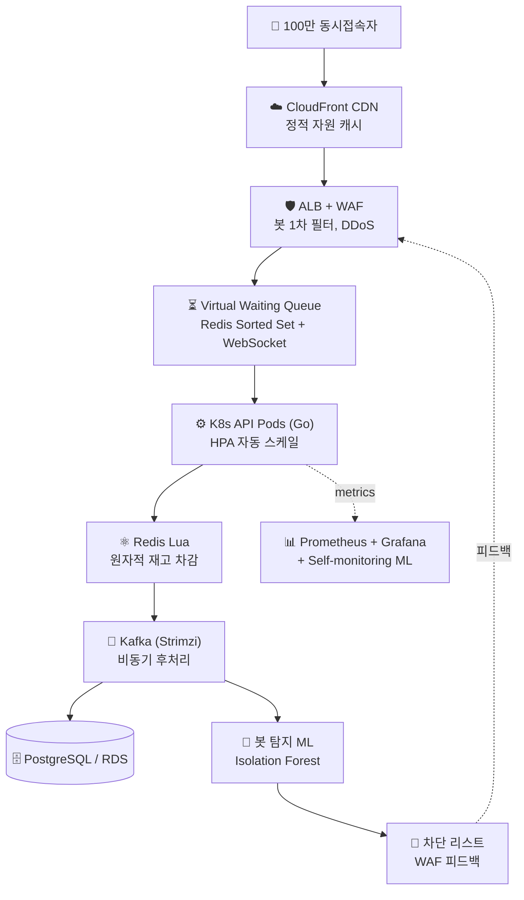

# 🎯 SRE Capstone — 한정판 발급 시스템 (100만 동접)

> 한국 e-commerce·retail의 실제 도전 — **한정 수량 + 트래픽 폭증 + 봇 탐지**를
> 직접 설계·구축하는 사이드 프로젝트 (작업 진행 중)

[]()
[]()
[]()
[]()

---

## 🏗 최종 목표 아키텍처 (Ch 10 캡스톤)



### 핵심 도전 (현재 상태)
- ✅ **동시성·정합성**: oversell 0건 (Redis Lua 원자 연산, Idempotency Key) — Phase C 단위 100 goroutine vs 재고 5에서 정확히 5 발급 / Phase D-2 클라우드 ALB 뒤에서 idempotent_replay 검증
- ⏳ **트래픽 처리**: 평소 100 RPS → 피크 100만 RPS (가상 대기열, Backpressure, HPA) — Phase D-2 HPA scale up 2→4 검증, 100만 RPS는 Phase J 부하 테스트
- ⏳ **봇 차단**: 매크로/스크립트 자동 탐지 + WAF 실시간 피드백 — Phase F (ALB annotation 한 줄로 WAF 연결, 가상 대기열이 1차 필터)
- ⏳ **SLO 운영**: p99 지연시간, 가용성, 재고 정합성 지표 정의·추적 — Phase H
- ⏳ **Self-monitoring**: 우리 시스템의 이상 신호를 우리 ML이 학습·탐지 — Phase F·H

---

## 📚 학습 로드맵 — 자체 설계, 직접 구축

캡스톤에 필요한 모든 인프라/도구를 **홈랩 VMware K8s에서 단계별 직접 구축** 후 AWS로 이전.
매니지드 서비스(EKS) 대신 **kubeadm 자체 구축** — 원리 이해 우선.

| # | 챕터 | 핵심 내용 | 상태 |
|:---:|------|---------|:--:|
| 01 | Linux + VMware + 네트워크 기초 | NAT, 사설 IP, DHCP/Gateway, 시스템 초기 세팅 | ✅ |
| 02 | Docker + 컨테이너 보안 | Docker CE, SELinux 통합, firewalld, Nginx 컨테이너 | ✅ |
| 03 | **Kubernetes 클러스터** | kubeadm + Calico CNI, 3 노드 자체 구축, 첫 워크로드 | ✅ |
| 04 | **K8s 실용 기능** | ConfigMap/Secret, PV/PVC, Ingress + cert-manager, **자체 Helm chart** | ✅ |
| 05 | **Ansible IaC** | 구성 관리 자동화, Ch01-04 모든 작업의 playbook화, 새 노드 5분 합류 | ✅ |
| 06 | **Observability** | kube-prometheus-stack, ServiceMonitor, PrometheusRule, Inhibit/Silence | ✅ |
| 07 | **CI/CD (GitOps)** | GitHub Actions → ghcr.io, ArgoCD auto-sync, Image Updater 풀 루프 | ✅ |
| 08 | **Terraform IaC** | AWS Free Tier에 VPC/EC2/S3 프로비저닝, Terraform + Ansible 조합, `destroy`로 $0 | ✅ |
| 09 | **K8s 보안** | NetworkPolicy(default-deny+allow), PSS(restricted), **Trivy CI 게이트(실제 CVE 패치)**, RBAC SA | ✅ |
| 10 | 🎯 **AWS 캡스톤** | 위 모든 도구의 실전 통합 — Go 백엔드 + 부하 테스트 + Post-mortem | 🚧 진행 중 |

### Ch 10 캡스톤 Phase 진행 상황 (10 Phase 중 5 완료)

| Phase | 내용 | 산출물 | 상태 |
|:--:|---|---|:--:|
| A | 멀티 AZ VPC + NAT + EKS 자동발견 태그 | `terraform/ch10/` + ADR-001~004 | ✅ |
| B | EKS 클러스터 + Managed Node Group + IRSA OIDC | eks.tf/nodes.tf/iam.tf/addons.tf + ADR-005~007 | ✅ |
| C | Go issue-api + Redis Lua 원자 재고 (oversell 0건) | `app/issue-api/` + ADR-008~010 | ✅ |
| D-1 | RDS Postgres + ElastiCache Redis + Secrets Manager + IRSA role | rds.tf/elasticache.tf/secrets.tf/iam_app.tf + ADR-011/012/014 | ✅ |
| D-2 | ECR + GitHub OIDC + ALB Controller + Helm chart + Pod IRSA 실증 + HPA scale up | ecr.tf/github_oidc.tf/iam_alb_controller.tf + `helm/issue-api/` + `.github/workflows/issue-api.yml` + ADR-013/015 | ✅ |
| E | 비동기 이벤트 큐 + 가상 대기열 + RDS 본격 활용 | SQS or MSK + 컨슈머 + 대기열 알고리즘 | ⏳ 다음 |
| F | 봇 탐지 + WAF 피드백 | ALB annotation 한 줄로 WAF 연결 | ⏳ |
| G | CI/CD 본격 (ArgoCD on EKS, Image Updater 확장) | Ch 07 패턴을 EKS에 이식 | ⏳ |
| H | Observability + SLO 정의 | Prometheus + Grafana + SLO 알람 | ⏳ |
| I | WAF + Secrets + NetworkPolicy 통합 보안 | Ch 09 패턴 EKS에 이식 | ⏳ |
| J | 🔥 부하 100만 + Chaos + Post-mortem | k6 시나리오 + chaos-mesh + 사후분석 | ⏳ |

→ **15개 ADR**(`adr/`)로 각 Phase의 *왜 이 기술인가* 박제. **매 세션 `terraform apply` 5분 스핀업 → 검증 → `destroy` $0 복귀** (on-demand 패턴, FinOps).

---

## 🖥 작업 환경 현황

**Ch 10 시작 시점에 홈랩 K8s를 종료**(`destroy`로 자원 정리) — 캡스톤이 AWS 매니지드 EKS로 자족이라 *홈랩 의존 종료*. Windows에서 직접 Terraform/Helm/kubectl 운영.

```
Windows 11 Pro (24C/64G)
├─ Terraform v1.15 (portable)    → terraform/ch10/ 48 자원 apply/destroy
├─ Helm v3.16 (portable)         → helm/issue-api/ 차트
├─ kubectl                       → aws eks update-kubeconfig 로 EKS 연결
├─ AWS CLI v2.17                 → user/terraform IAM (콘솔 접근 X, AccessKey만)
└─ AWS Budgets $20 임계          → 비용 안전망

AWS Account 675369196126 (ap-northeast-2)
└─ 매 세션 apply→검증→destroy ($0 복귀)
```

### 홈랩 운영(Ch 01-09) — 종료된 자산
홈랩 K8s 3노드 클러스터(rocky-master + worker×3, K8s 1.33.11 / Calico VXLAN / kubeadm)에서 Ch 01-09의 모든 학습 진행. `ansible/ch05/` playbook으로 *언제든 5분 내 재구축* 가능 — IaC가 보존하는 환경 재현성. Ch 04(자체 Helm chart), Ch 06(kube-prometheus-stack), Ch 07(ArgoCD GitOps + Image Updater 풀루프), Ch 09(NetworkPolicy + PSS + Trivy + RBAC 4층 보안) 모두 실증 완료.

### Ch 10 Phase D-2 검증 결과 (마지막 apply 세션, 2026-05-17)
- **`/aws-check` → IRSA 실증** — Pod의 SA token이 sts:AssumeRoleWithWebIdentity로 IAM role 받아 Secrets Manager에서 24자 password 길이 확인. 비번 값은 응답에 절대 미노출(`value_length`만)
- **Redis Lua 멱등성 클라우드 실증** — `POST /issue` 2회(다른 idem key) → 다른 KSUID 발급, stock 100→98. 같은 key 재요청 → **같은 KSUID + status=idempotent_replay**, stock 차감 안 함. ADR-008/010 통과
- **HPA scale up 실증** — 30 병렬 curl 부하 → +60s: cpu 123%, replicas 2→3 / +120s: cpu 69%(목표 도달), replicas 3→4
- **GitHub OIDC → ECR push** — `aws-actions/configure-aws-credentials@v4`로 AccessKey 없이 push. trust의 `sub` 조건이 `repo:airflowboy/sre-project:ref:refs/heads/main`로 fork PR 차단

### Observability 스택 (Ch 06 산출)
```
monitoring 네임스페이스 — kube-prometheus-stack 풀 컴포넌트
├─ prometheus-operator   (CRD 컨트롤러)
├─ prometheus            (시계열 DB, 10Gi PVC, 7d retention)
├─ alertmanager          (알람 라우팅, 2Gi PVC)
├─ grafana               (대시보드, 5Gi PVC, 자동 25+ 대시보드)
├─ kube-state-metrics    (K8s 객체 메트릭)
└─ node-exporter × 4     (DaemonSet, 노드 메트릭)
```
- **HTTPS 노출** — `grafana / prometheus / alertmanager . <IP>.nip.io` (subdomain 분리, 자체 CA)
- **ServiceMonitor** — ingress-nginx RED 메트릭 자동 수집 (`release: prometheus` 라벨 매칭)
- **PrometheusRule** — `HighErrorRate` (5xx 발생 시 firing), 의도적 firing 시나리오로 alert lifecycle 검증
- **Inhibit 룰** — kube-prometheus-stack의 `InfoInhibitor` 메커니즘 발견·이해 (운영 노이즈 자동 억제)

### CI/CD GitOps 파이프라인 (Ch 07 산출)
```
코드 push  →  GitHub Actions (build.yml): Go 앱 빌드 → ghcr.io/airflowboy/sre-project/web-app:sha-<커밋>
   ↓ (불변 SHA 태그)
ArgoCD Image Updater (v1.1.1): 새 이미지 감지 → deploy/web-app/.argocd-source 자동 commit (SSH deploy key)
   ↓
ArgoCD: 봇 커밋 감지 → auto-sync (prune + selfHeal) → RollingUpdate
   ↓
web-app 라이브 (webapp.<IP>.nip.io, HTTPS)        ← 사람이 한 건 git push 1회
```
- **CI** — GitHub Actions, multi-stage Dockerfile(distroless), `GITHUB_TOKEN`으로 ghcr 푸시, `paths` 필터로 무한루프 차단
- **CD** — ArgoCD (Helm 설치, `argocd.<IP>.nip.io` HTTPS), Application `automated: {prune, selfHeal}` — git이 단일 진실 공급원
- **자동화 검증** — git→배포 / 수동 일탈→self-heal / `git revert`→롤백 / 깨진 이미지→RollingUpdate 무중단 / 코드 변경→Image Updater 풀 루프

### K8s 보안 4층 (Ch 09 산출)
```
demo-sec namespace (격리된 데모 ns) — 4층의 "기본 거부, 명시 허용"
├─ L3/L4  NetworkPolicy   default-deny-ingress + selective allow (Calico dataplane)
├─ L7     PSS              enforce=restricted (runAsNonRoot/drop ALL caps/seccomp/no-priv-esc)
├─ 이미지  Trivy CI 게이트    HIGH/CRITICAL CVE 발견 시 build.yml exit 1 → 실제 CVE-2025-68121 잡아서 Go 1.23→1.25 패치
└─ RBAC   SA + Role + RoleBinding 최소권한 (kubectl auth can-i --as= 매트릭스 검증)
```
- **Defense in depth 실제 작동** — NetworkPolicy(L3/L4)와 PSS(L7) 적층, 한 층 뚫려도 다음 층 차단
- **Trivy가 실제 CVE 검출** — distroless(0) vs nginx:1.20(Total 154) 정량 비교. CI red → 패치 → green → Image Updater → cluster까지 자동
- **Ch 02 firewalld/SELinux의 K8s 버전** — 같은 철학, 새로운 매트릭스

### AWS IaC — On-demand (Ch 08 산출)
```
terraform/ch08/   VPC(10.0.0.0/16) + 퍼블릭 서브넷 + IGW + 라우트 + SG + EC2 t2.micro + S3
                  (data "http"로 내 IP 자동탐지 → SSH 인그레스, data "aws_ami"로 최신 AL2023)
ansible/ch08/     terraform output → 인라인 인벤토리 → playbook (hostname/timezone/패키지)
```
- **실제 AWS Free Tier** (`ap-northeast-2`) — `terraform apply`로 5분 내 구축, **세션 끝 `terraform destroy` → $0** (On-demand 패턴, FinOps 마인드)
- **provision = Terraform / configure = Ansible** 역할 분리 — 캡스톤 Phase A→B(Terraform AWS 인프라 → Ansible kubeadm prereq → kubeadm init)의 예행연습
- IAM 사용자 + 루트 MFA 봉인 + AWS Budgets 알림 (비용 안전 3종)

### Ansible 자동화 (Ch 05 산출)
```
새 노드 추가 = inventory 한 줄 추가 + playbook 한 번 실행 (5분)
              ↑                                    ↑
              하던 수동 작업 70분이 ↓
```
4개 playbook (`hello.yml`, `system-base.yml`, `k8s-prereq.yml`, `join-worker.yml`)으로
Ch 01-04의 모든 시스템 설정이 IaC 코드화됨. 멱등성(idempotency) 직접 검증.

---

## 🛠 다룬 / 다룰 기술 스택

### 인프라 / 컨테이너


### IaC / CI-CD / 자동화


### 네트워크 / 보안


### Observability


### 데이터 / 메시지


-231F20?style=flat&logo=apachekafka&logoColor=white)

### 백엔드


### 클라우드 (AWS)


---

## 📈 이 Repo의 진화 계획

```
[Ch 01-09 학습 챕터 완료]                  [Ch 10 캡스톤 5/10 Phase 완료]      [남은 Phase E~J]
app/web-app/             (Ch 07 미니서비스) + app/issue-api/    (Phase C-D)    + load-test/   (Phase J k6)
.github/workflows/       (Ch 07/09 CI)      + helm/issue-api/   (Phase D-2)    + postmortem/  (Phase J 분석)
deploy/web-app/          (Ch 07 chart)      + terraform/ch10/   (Phase A-D-2)   + assets/      (HPA GIF 등)
terraform/ch08/          (Ch 08 AWS IaC)    + adr/              (15 ADR)
ansible/ch08/            (Ch 08 configure)  + .github/workflows/issue-api.yml  (OIDC→ECR push)
k8s-security/ch09/       (Ch 09 보안)
```

→ 같은 URL 유지하며 점진 진화. **commit history가 학습·구축 여정의 시각 증거**:
- Image Updater 봇 커밋 (Ch 07 — git이 단일 진실)
- Terraform 자원 라이프사이클 (Ch 08·10 — apply/destroy 반복)
- Trivy CI red → Go 1.23→1.25 패치 → green (Ch 09 — 실제 CVE 차단)
- ADR 박제 (Ch 10 — 15개 결정 기록, "왜 X를 골랐나" 면접 답)
- Phase D-2의 OIDC 정공법 push (정적 AccessKey 없이 ECR push)

---

## 📚 네트워크 기초 학습 자료 (참조용)

DevOps/SRE 관점에서 네트워크가 흐릿할 때마다 돌아와 보는 가이드. **"아파트 단지" 단일 비유**로 VPC·서브넷·IP·포트·NAT·LB·K8s 네트워킹을 꿰뚫음.

→ **[`network-basics/`](network-basics/)** — README 한 페이지부터 시작, 6개 토픽 파일로 깊이.

| 파일 | 언제 보기 |
|------|----------|
| [README](network-basics/README.md) | 큰 그림 + 비유 매핑 표 + 자가 진단 5문제 |
| [01-basics](network-basics/01-basics.md) | IP·CIDR·포트·DNS·OSI |
| [02-routing-and-nat](network-basics/02-routing-and-nat.md) | 라우팅 테이블, IGW vs NAT GW |
| [03-firewalls](network-basics/03-firewalls.md) | SG · NACL · 호스트 방화벽 |
| [04-load-balancers](network-basics/04-load-balancers.md) | L4 vs L7, ALB vs NLB |
| [05-aws-vpc](network-basics/05-aws-vpc.md) | VPC 구조 (Ch 08·10 직결) |
| [06-kubernetes](network-basics/06-kubernetes.md) | Pod IP · Service · Ingress · NetworkPolicy · CNI |

---

## 📝 학습 철학

- **직접 손으로 만들고, 매 단계 "왜 그런지" 원리까지 이해** — 튜토리얼 따라하기 X
- **운영급 트러블슈팅 경험 박제** — Pod-to-Pod 차단, Calico Typha, kubeadm reset 잔재 등 실제 운영에서 마주칠 사고 직접 디버깅
- **캡스톤 중심 설계** — 모든 챕터가 Ch 10 한정판 발급 시스템 구축에 직결되도록 자체 설계
- **현실적 운영 감각** — 매니지드 회피로 원리 이해, FinOps 마인드 (terraform destroy 패턴), 사후 분석 문서화

---

## 🤝 Contact

본 프로젝트는 사이드 학습 프로젝트입니다. 의견·질문 환영.

<!-- 본인 정보 추가하실 곳:
- Email: 
- LinkedIn: 
- 다른 GitHub repo: 
-->
